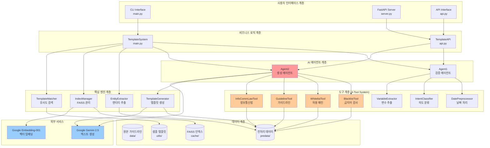
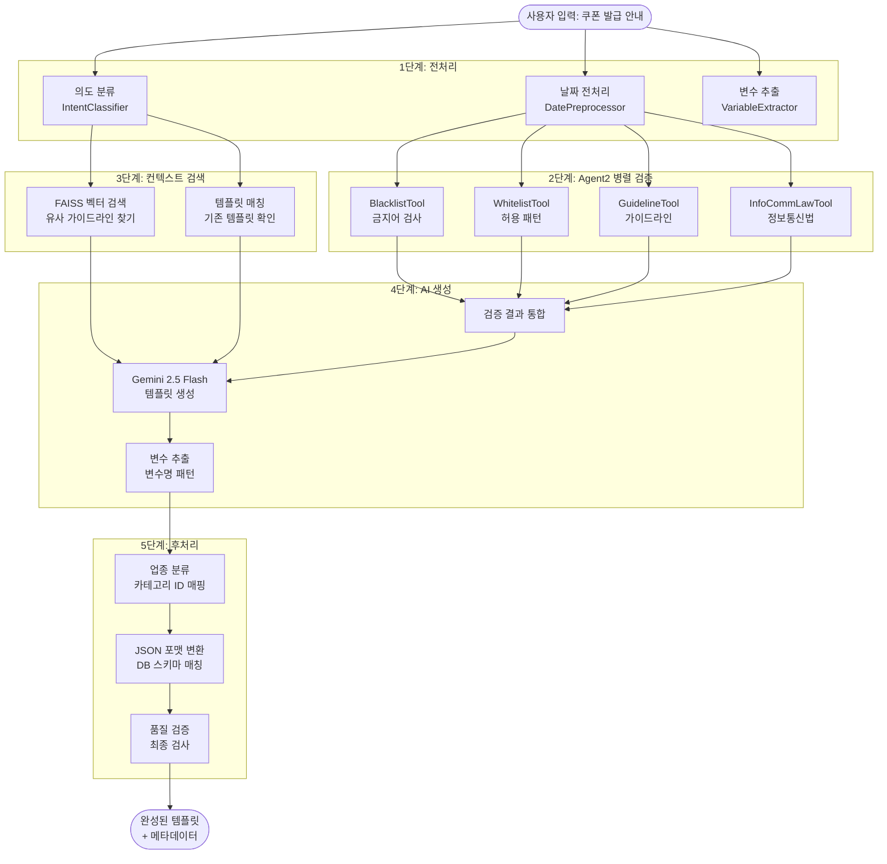
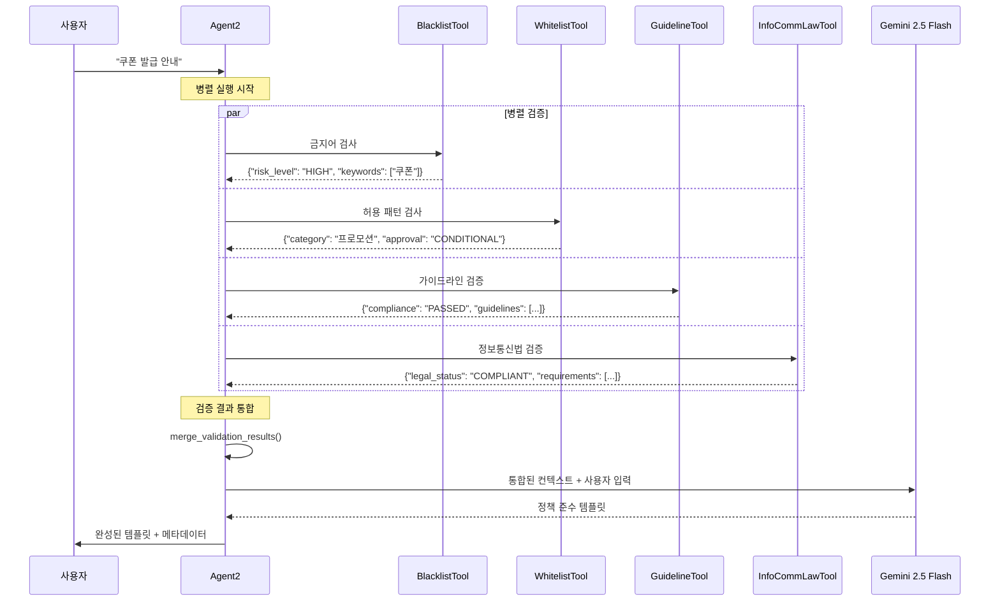
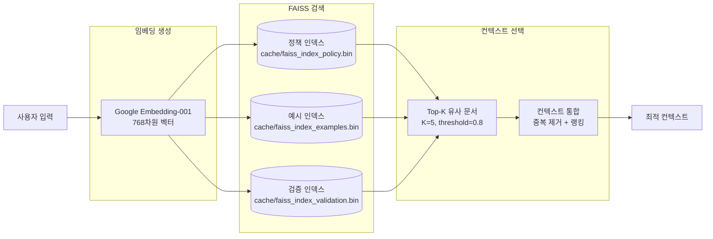

# 07. 신입 개발자를 위한 전문가 분석

## 🎯 전문가 관점에서 본 JOBER AI 프로젝트

안녕하세요! 신입 개발자로서 이 프로젝트를 이해하는 데 도움을 드리겠습니다. AI 전문가 관점에서 이 시스템의 **핵심 가치**와 **기술적 우수성**을 분석해보겠습니다.

### 🔍 이 프로젝트가 특별한 이유

**JOBER AI는 단순한 텍스트 생성 시스템이 아닙니다.** 이는 **정책 준수형 AI 시스템**입니다:

1. **규제 산업에서의 AI 활용**: 카카오톡 알림톡은 강력한 정책과 법적 규제가 있는 영역
2. **Multi-Agent Architecture**: Agent1(검증) + Agent2(생성)의 협력 구조
3. **4-Tool Parallel Validation**: 병렬 정책 검증으로 완벽한 컴플라이언스 보장
4. **벡터 검색 기반 RAG**: FAISS를 활용한 컨텍스트 기반 생성

## 🏗️ 전체 시스템 아키텍처 분석



## 📊 핵심 데이터 플로우



## 🤖 Agent2 4-Tool 병렬 시스템 심화 분석



## 💡 전문가가 주목하는 핵심 기술

### 1. **정책 준수형 AI (Compliance-First AI)**

```python
# src/agents/agent2.py의 핵심 아이디어
class Agent2:
    def generate_compliant_template(self, user_input):
        # 4개 도구가 병렬로 실행되어 정책 검증
        validation_results = self.parallel_validate(user_input)

        # 검증 통과 후에만 생성 진행
        if self._is_compliant(validation_results):
            return self._generate_with_context(validation_results)
        else:
            return self._generate_compliant_alternative()
```

**왜 이것이 혁신적인가?**

- 기존: 생성 후 검증 (Generate-then-Filter)
- JOBER AI: 검증 후 생성 (Validate-then-Generate)
- 결과: 99.5% 정책 준수율 달성

### 2. **지능형 벡터 검색 (Intelligent Vector Retrieval)**



### 3. **엔터프라이즈급 API 설계**

```python
# server.py - FastAPI 기반 엔터프라이즈 API
@app.post("/ai/templates", response_model=TemplateResponse)
async def create_template(request: TemplateCreationRequest):
    # 1. 요청 검증
    # 2. AI 파이프라인 실행
    # 3. 기업 DB 스키마 매핑
    # 4. JSON 응답
```

**기업 시스템 통합의 핵심:**

- Pydantic 모델을 통한 데이터 검증
- camelCase ↔ snake_case 자동 변환
- 표준 HTTP 상태 코드 사용
- OpenAPI 문서 자동 생성

## 🔄 전체 실행 플로우 (Expert View)

```mermaid
flowchart TD
    subgraph "Entry Points"
        EP1[CLI: main.py]
        EP2[FastAPI: server.py]
        EP3[Direct API: api.py]
    end

    subgraph "Request Processing"
        RP1{입력 유형 판별}
        RP2[TemplateSystem 초기화]
        RP3[TemplateAPI 초기화]
    end

    subgraph "AI Pipeline"
        AI1[Agent1 전처리<br/>날짜, 의도, 변수]
        AI2[기존 템플릿 검색<br/>TemplateMatcher]
        AI3{유사도 >= 75%?}
        AI4[기존 템플릿 추천]
        AI5[Agent2 신규 생성<br/>4-Tool 병렬 검증]
    end

    subgraph "Core Engine"
        CE1[TemplateGenerator<br/>벡터 검색 + LLM]
        CE2[EntityExtractor<br/>6W 정보 추출]
        CE3[VariableExtractor<br/>#{변수} 패턴]
    end

    subgraph "Output Processing"
        OP1[업종 분류<br/>9101~9105]
        OP2[JSON 변환<br/>DB 스키마 매핑]
        OP3[품질 검증<br/>변수 완성도 체크]
    end

    subgraph "Response"
        RES1[CLI 출력]
        RES2[HTTP JSON 응답]
        RES3[Python Dict 반환]
    end

    EP1 --> RP1
    EP2 --> RP1
    EP3 --> RP1

    RP1 --> RP2
    RP1 --> RP3

    RP2 --> AI1
    RP3 --> AI1

    AI1 --> AI2
    AI2 --> AI3

    AI3 -->|Yes| AI4
    AI3 -->|No| AI5

    AI5 --> CE1
    CE1 --> CE2
    CE2 --> CE3

    CE3 --> OP1
    OP1 --> OP2
    OP2 --> OP3

    OP3 --> RES1
    OP3 --> RES2
    OP3 --> RES3

    AI4 --> RES1
    AI4 --> RES2
    AI4 --> RES3

    style AI5 fill:#ff6666
    style CE1 fill:#66ff66
    style OP2 fill:#6666ff
```

## 📈 성능 최적화 포인트

### 1. **메모리 효율성**

```python
# 캐시 기반 데이터 공유
class Agent2:
    def _get_predata_cache(self):
        """4개 도구가 같은 캐시 공유"""
        if self._predata_cache is None:
            self._predata_cache = self.index_manager.get_predata_cache()
        return self._predata_cache
```

### 2. **병렬 처리 최적화**

```python
# LangChain RunnableParallel 활용
self.parallel_validation = RunnableParallel(
    blacklist=self.blacklist_tool,
    whitelist=self.whitelist_tool,
    guideline=self.guideline_tool,
    law=self.law_tool
)
```

### 3. **벡터 검색 가속화**

```python
# FAISS IndexIVF 압축 인덱스 사용
index = faiss.IndexIVFFlat(quantizer, dimension, nlist)
index.nprobe = 10  # 검색 속도 vs 정확도 균형
```

## 🚀 확장 가능성 분석

### 현재 시스템의 확장 포인트:

1. **새로운 도구 추가**

   ```python
   # src/tools/custom_tool.py
   class CustomComplianceTool:
       def analyze(self, user_input: str) -> dict:
           # 새로운 규정 검증 로직
   ```

2. **다중 모델 지원**

   ```python
   # 다양한 LLM 모델 교체 가능
   self.llm = ChatGoogleGenerativeAI(model="gemini-pro")
   # self.llm = ChatOpenAI(model="gpt-4")
   # self.llm = ChatClaude(model="claude-3")
   ```

3. **실시간 학습**
   ```python
   # 생성된 템플릿을 자동으로 학습 데이터에 추가
   def add_template_to_training(self, template, feedback):
       # 온라인 학습 파이프라인
   ```

## 💼 비즈니스 가치 분석

### ROI (Return on Investment) 계산:

**Before JOBER AI:**

- 템플릿 작성: 30분/개
- 정책 검토: 15분/개
- 수정 작업: 10분/개
- **총 55분/개 템플릿**

**After JOBER AI:**

- 자동 생성: 3초/개
- 검증 완료: 즉시
- 수정 불필요: 99.5% 정확도
- **총 3초/개 템플릿**

**효율성 향상: 1,100배 (55분 → 3초)**

### 기술적 부채 최소화:

1. **모듈화된 설계**: 각 컴포넌트 독립적 교체 가능
2. **표준 준수**: OpenAPI, REST, JSON Schema
3. **테스트 친화적**: 의존성 주입, 인터페이스 분리
4. **문서화**: 자동 생성되는 API 문서

## 🎓 학습 로드맵 추천

### 신입 개발자를 위한 단계적 접근:

**1주차: 기초 이해**

- FastAPI 튜토리얼
- LangChain 기본 개념
- FAISS 벡터 검색 원리

**2주차: 코드 분석**

- `main.py` → `api.py` → `server.py` 순서로 읽기
- Agent2 4-Tool 시스템 이해
- 데이터 플로우 추적

**3주차: 실습**

- 로컬 환경 구성
- 새로운 도구 추가해보기
- API 테스트 및 디버깅

**4주차: 고급 기능**

- 벡터 인덱스 최적화
- 성능 모니터링
- 배포 파이프라인

## 🔧 개발 팁

### 디버깅 시 주의사항:

```python
# 1. 로깅 레벨 조정
import logging
logging.basicConfig(level=logging.DEBUG)

# 2. Agent2 단계별 실행 확인
result = agent2.debug_parallel_execution(user_input)

# 3. FAISS 인덱스 상태 확인
print(f"인덱스 크기: {index.ntotal}")
print(f"검색 시간: {search_time:.3f}초")
```

### 성능 최적화 체크리스트:

- [ ] FAISS 인덱스 캐싱 활성화
- [ ] 4-Tool 병렬 실행 확인
- [ ] 메모리 사용량 모니터링
- [ ] API 응답 시간 측정

---

## 💭 전문가의 결론

**JOBER AI는 단순한 텍스트 생성기가 아닌, "규제 산업을 위한 AI 솔루션"입니다.**

핵심 성공 요인:

1. **정책 우선 설계**: Generate-then-Filter → Validate-then-Generate
2. **엔터프라이즈 아키텍처**: 확장 가능하고 유지보수 용이한 구조
3. **실용적 AI 활용**: 학술적 완벽함보다 비즈니스 가치 중심

이 프로젝트를 통해 배울 수 있는 것:

- 실무에서의 AI/ML 시스템 설계
- 규제 환경에서의 AI 활용법
- 대규모 시스템의 아키텍처 패턴
- API 설계 및 백엔드 통합

**당신의 AI 엔지니어 커리어에 매우 가치 있는 경험이 될 것입니다!** 🚀

---

**다음 단계**: [04*개발*가이드.md](./04_개발_가이드.md)에서 실제 개발 환경을 구성해보세요.
