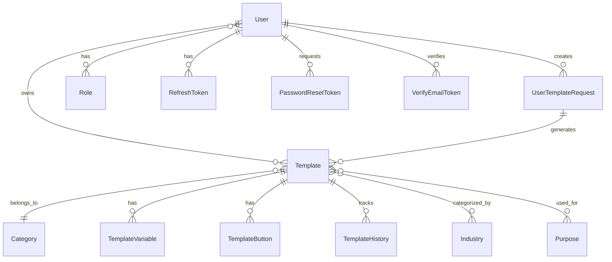

# 02. 데이터베이스 설계 및 엔티티

## 데이터베이스 개요

### 데이터베이스 정보
- **DBMS**: MySQL 8.0.42
- **캐릭터셋**: utf8mb4 (이모지 지원)
- **타임존**: Asia/Seoul
- **연결**: HikariCP (최대 10개 커넥션)
- **마이그레이션**: Flyway (dev 프로파일에서 활성화)

### 스키마 관리 전략
- **개발 환경**: DDL Auto-update 사용
- **운영 환경**: Flyway Validate 모드로 스키마 검증
- **JPA Auditing**: 생성/수정 일시 자동 관리

## 엔티티 관계도

## 엔티티 상세 분석

### 1. User (사용자)
**테이블명**: `user`
**주요 기능**: 시스템 사용자 정보 관리

#### 필드 구조
| 필드명 | 타입 | 제약조건 | 설명 |
|--------|------|----------|------|
| id | BIGINT | PK, AUTO_INCREMENT | 사용자 고유 ID |
| email | VARCHAR(255) | NOT NULL, UNIQUE | 로그인용 이메일 |
| passwordHash | VARCHAR(255) | NOT NULL | BCrypt 암호화된 패스워드 |
| name | VARCHAR(100) | NOT NULL | 사용자 이름 |
| status | ENUM | NOT NULL | PENDING/ACTIVE/INACTIVE |
| locked | BOOLEAN | NOT NULL, DEFAULT false | 계정 잠금 상태 |
| lockedAt | DATETIME | NULL | 계정 잠금 시간 |
| lastLoginAt | DATETIME | NULL | 마지막 로그인 시간 |
| failCount | INT | NOT NULL, DEFAULT 0 | 로그인 실패 횟수 |
| createdAt | DATETIME | NOT NULL | 생성일시 |
| updatedAt | DATETIME | NOT NULL | 수정일시 |

#### 관계
- **Many-to-Many**: Role (user_role_mapping 테이블을 통해)
- **One-to-Many**: Template, UserTemplateRequest, RefreshToken 등

### 2. Role (권한)
**테이블명**: `role`
**주요 기능**: 사용자 권한 관리

#### 필드 구조
| 필드명 | 타입 | 제약조건 | 설명 |
|--------|------|----------|------|
| role_id | BIGINT | PK, AUTO_INCREMENT | 역할 고유 ID |
| role_name | VARCHAR(50) | NOT NULL, UNIQUE | 권한명 (예: USER, ADMIN) |

### 3. Template (템플릿)
**테이블명**: `template`
**주요 기능**: AI 생성 템플릿 정보 관리

#### 필드 구조
| 필드명 | 타입 | 제약조건 | 설명 |
|--------|------|----------|------|
| id | BIGINT | PK, AUTO_INCREMENT | 템플릿 고유 ID |
| user_id | BIGINT | NOT NULL, FK | 템플릿 소유자 |
| category_id | BIGINT | NOT NULL, FK | 템플릿 카테고리 |
| user_template_request_id | BIGINT | FK | 생성 요청 정보 |
| title | VARCHAR(500) | NULL | 템플릿 제목 |
| content | LONGTEXT | NULL | 템플릿 내용 (HTML) |
| status | ENUM | NULL | CREATED/APPROVED/REJECTED |
| type | ENUM | NULL | 템플릿 유형 |
| is_public | BOOLEAN | NULL | 공개 여부 |
| image_url | VARCHAR(500) | NULL | 썸네일 이미지 URL |
| reject_reason | VARCHAR(500) | NULL | 거부 사유 |
| reject_reason_summary | VARCHAR(500) | NULL | 거부 사유 요약 |
| createdAt | DATETIME | NOT NULL | 생성일시 |
| updatedAt | DATETIME | NOT NULL | 수정일시 |

#### 관계
- **Many-to-One**: User, Category, UserTemplateRequest
- **One-to-Many**: TemplateVariable, TemplateButton, TemplateHistory
- **Many-to-Many**: Industry, Purpose

### 4. UserTemplateRequest (사용자 템플릿 요청)
**테이블명**: `user_template_request`
**주요 기능**: AI 템플릿 생성 요청 추적

#### 필드 구조
| 필드명 | 타입 | 제약조건 | 설명 |
|--------|------|----------|------|
| id | BIGINT | PK, AUTO_INCREMENT | 요청 고유 ID |
| user_id | BIGINT | NOT NULL, FK | 요청 사용자 |
| request_content | LONGTEXT | NOT NULL | 사용자 요청 내용 |
| status | ENUM | NOT NULL | PENDING/COMPLETED/FAILED |
| error_message | VARCHAR(500) | NULL | 실패 시 에러 메시지 |
| createdAt | DATETIME | NOT NULL | 요청 생성일시 |
| updatedAt | DATETIME | NOT NULL | 상태 변경일시 |

#### 상태 관리
- **PENDING**: 요청 처리 중
- **COMPLETED**: 성공적으로 템플릿 생성
- **FAILED**: 처리 실패 (에러 메시지 포함)

### 5. TemplateVariable (템플릿 변수)
**테이블명**: `template_variable`
**주요 기능**: 템플릿 내 동적 변수 관리

#### 필드 구조
| 필드명 | 타입 | 제약조건 | 설명 |
|--------|------|----------|------|
| id | BIGINT | PK, AUTO_INCREMENT | 변수 고유 ID |
| template_id | BIGINT | NOT NULL, FK | 소속 템플릿 |
| variable_key | VARCHAR(100) | NOT NULL | 변수 키 |
| placeholder | VARCHAR(200) | NULL | 입력 필드 플레이스홀더 |
| input_type | VARCHAR(50) | NULL | 입력 필드 유형 |
| createdAt | DATETIME | NOT NULL | 생성일시 |

### 6. TemplateButton (템플릿 버튼)
**테이블명**: `template_button`
**주요 기능**: 템플릿 내 액션 버튼 관리

#### 필드 구조
| 필드명 | 타입 | 제약조건 | 설명 |
|--------|------|----------|------|
| id | BIGINT | PK, AUTO_INCREMENT | 버튼 고유 ID |
| template_id | BIGINT | NOT NULL, FK | 소속 템플릿 |
| name | VARCHAR(100) | NOT NULL | 버튼 이름 |
| ordering | INT | NOT NULL | 버튼 순서 |
| link_pc | VARCHAR(500) | NULL | PC용 링크 |
| link_and | VARCHAR(500) | NULL | 안드로이드용 링크 |
| link_ios | VARCHAR(500) | NULL | iOS용 링크 |
| createdAt | DATETIME | NOT NULL | 생성일시 |

### 7. TemplateHistory (템플릿 히스토리)
**테이블명**: `template_history`
**주요 기능**: 템플릿 상태 변경 이력 추적

#### 필드 구조
| 필드명 | 타입 | 제약조건 | 설명 |
|--------|------|----------|------|
| id | BIGINT | PK, AUTO_INCREMENT | 히스토리 고유 ID |
| template_id | BIGINT | NOT NULL, FK | 대상 템플릿 |
| status | ENUM | NOT NULL | 변경된 상태 |
| createdAt | DATETIME | NOT NULL | 상태 변경일시 |

### 8. Category (카테고리)
**테이블명**: `category`
**주요 기능**: 템플릿 분류 체계

#### 필드 구조
| 필드명 | 타입 | 제약조건 | 설명 |
|--------|------|----------|------|
| id | BIGINT | PK, AUTO_INCREMENT | 카테고리 고유 ID |
| name | VARCHAR(255) | NOT NULL | 카테고리 명 |
| parent_id | BIGINT | NULL, FK | 상위 카테고리 (계층 구조) |
| createdAt | DATETIME | NOT NULL | 생성일시 |

### 9. Industry (산업군)
**테이블명**: `industry`
**주요 기능**: 템플릿 산업군 분류

#### 필드 구조
| 필드명 | 타입 | 제약조건 | 설명 |
|--------|------|----------|------|
| id | BIGINT | PK, AUTO_INCREMENT | 산업군 고유 ID |
| name | VARCHAR(255) | NOT NULL | 산업군 명 |
| createdAt | DATETIME | NOT NULL | 생성일시 |

#### Many-to-Many 관계
- **template_industry** 테이블을 통해 Template과 연결

### 10. Purpose (목적)
**테이블명**: `purpose`
**주요 기능**: 템플릿 사용 목적 분류

#### 필드 구조
| 필드명 | 타입 | 제약조건 | 설명 |
|--------|------|----------|------|
| id | BIGINT | PK, AUTO_INCREMENT | 목적 고유 ID |
| name | VARCHAR(255) | NOT NULL | 목적명 |
| createdAt | DATETIME | NOT NULL | 생성일시 |

#### Many-to-Many 관계
- **template_purpose** 테이블을 통해 Template과 연결

## 보안 관련 엔티티

### 11. RefreshToken (리프레시 토큰)
**주요 기능**: JWT 리프레시 토큰 관리

### 12. PasswordResetToken (패스워드 재설정 토큰)
**주요 기능**: 패스워드 재설정 요청 관리

### 13. VerifyEmailToken (이메일 인증 토큰)
**주요 기능**: 이메일 인증 요청 관리

## ENUM 타입 정의

### TemplateStatus
- **CREATED**: 생성됨
- **APPROVED**: 승인됨  
- **REJECTED**: 거부됨

### UserTemplateRequestStatus
- **PENDING**: 처리 중
- **COMPLETED**: 완료
- **FAILED**: 실패

### User.Status
- **PENDING**: 대기 중 (이메일 인증 전)
- **ACTIVE**: 활성 상태
- **INACTIVE**: 비활성 상태

## 인덱스 및 성능 최적화

### 주요 인덱스
- **user.email**: 로그인 성능 최적화
- **template.user_id**: 사용자별 템플릿 조회 최적화
- **template.status**: 상태별 템플릿 검색 최적화
- **user_template_request.user_id**: 사용자별 요청 이력 조회

### JPA 최적화
- **FetchType.LAZY**: 지연 로딩으로 성능 최적화
- **@Builder**: 객체 생성 패턴 일관성
- **CascadeType.ALL**: 연관 데이터 자동 관리
- **orphanRemoval = true**: 고아 객체 자동 삭제

## 데이터 무결성 보장

### 외래키 제약조건
- 모든 연관 관계에 대해 외래키 제약조건 설정
- ON DELETE CASCADE 정책으로 데이터 일관성 보장

### 비즈니스 규칙
- User 삭제 시 연관된 모든 템플릿 및 토큰 정보 함께 삭제
- Template 상태 변경 시 TemplateHistory에 자동 기록
- UserTemplateRequest 상태에 따른 Template 생성 프로세스 제어

이러한 데이터베이스 설계는 템플릿 관리 시스템의 복잡한 비즈니스 요구사항을 효율적으로 지원하며, 확장성과 데이터 무결성을 보장합니다.