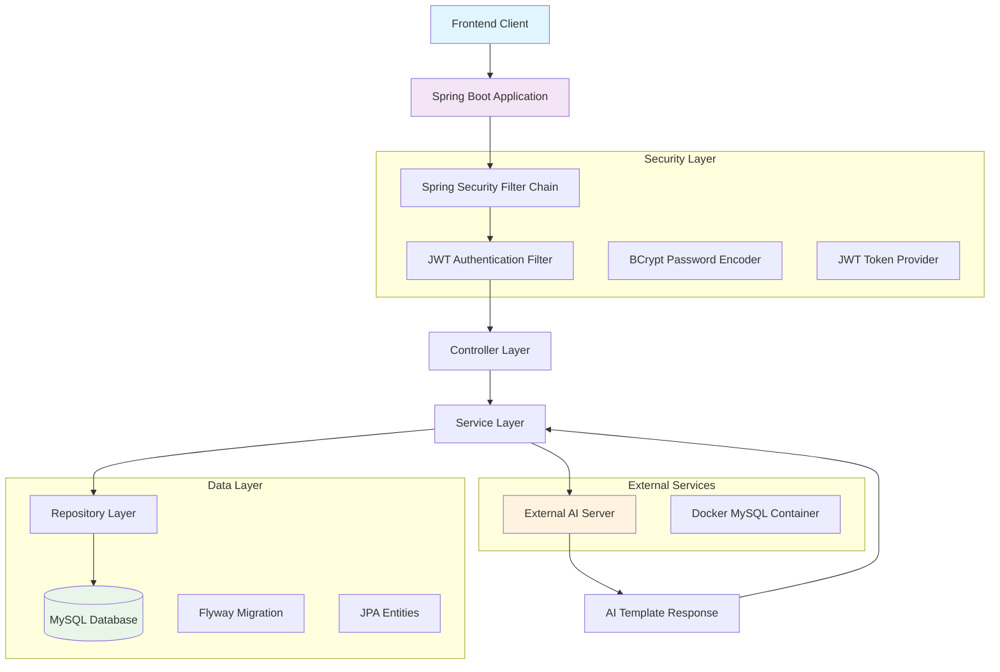
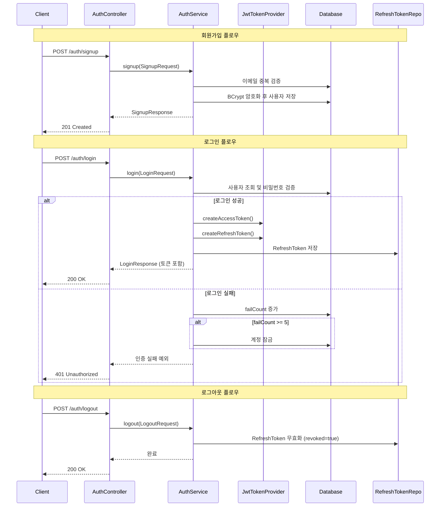
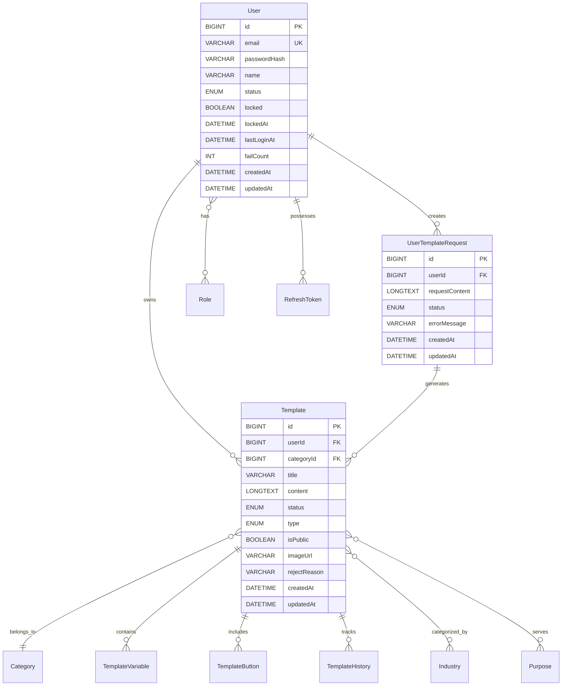
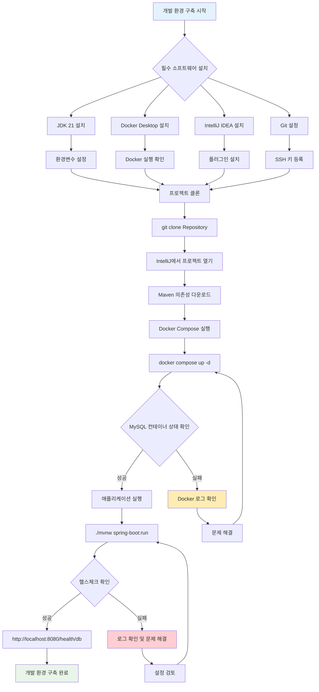

# 06. 신규 개발자 가이드 플로우차트

## 개요

이 문서는 Final3team-jober_to_java 프로젝트에 처음 참여하는 개발자를 위한 **시각적 플로우차트**와 **상세 가이드**를 제공합니다. 프로젝트의 전체적인 흐름을 이해하고 개발 환경을 신속하게 구축할 수 있도록 돕습니다.

---

## 1. 전체 시스템 아키텍처 플로우



### 시스템 구성 요소 설명

1. **Frontend Client**: 웹 또는 모바일 클라이언트
2. **Spring Boot Application**: 메인 백엔드 애플리케이션
3. **Security Layer**: JWT 기반 인증/인가 처리
4. **Data Layer**: JPA/Hibernate를 통한 데이터 액세스
5. **External Services**: AI 서버 및 Docker 컨테이너

---

## 2. 사용자 인증 플로우



### 인증 플로우 핵심 포인트

1. **비밀번호 보안**: BCrypt로 해싱, 솔트 자동 생성
2. **실패 처리**: 5회 실패 시 자동 계정 잠금
3. **토큰 관리**: Access Token (30분) + Refresh Token (14일)
4. **무상태 인증**: 서버에 세션 상태 미저장

---

## 3. AI 템플릿 생성 플로우

```mermaid
flowchart TD
    A[사용자 템플릿 요청] --> B[TemplateController]
    B --> C[TemplateService.createTemplate()]
    C --> D[UserTemplateRequest 저장]
    D --> E{AI 서버 호출}
    
    E -->|성공| F[AI 응답 파싱]
    E -->|실패| G[에러 처리]
    
    F --> H[Template 엔티티 생성]
    H --> I[TemplateVariable 생성]
    I --> J[TemplateButton 생성]
    J --> K[Industry/Purpose 매핑]
    K --> L[TemplateHistory 기록]
    L --> M[UserTemplateRequest 상태 업데이트]
    M --> N[응답 반환]
    
    G --> O[UserTemplateRequest FAILED]
    O --> P[에러 메시지 저장]
    P --> Q[예외 발생]
    
    subgraph "AI Server 연동"
        R[POST http://3.38.180.216:8000/ai/templates]
        S[AiTemplateRequest]
        T[AiTemplateResponse]
    end
    
    subgraph "데이터베이스 트랜잭션"
        H
        I
        J
        K
        L
        M
    end
    
    style E fill:#ffecb3
    style G fill:#ffcdd2
    style N fill:#c8e6c9
```

### AI 템플릿 생성 상세 단계

1. **요청 접수**: 사용자 요청 내용을 `UserTemplateRequest`에 저장
2. **AI 호출**: RestClient로 외부 AI 서버 호출
3. **응답 처리**: AI 응답을 파싱하여 Template 엔티티 생성
4. **연관 데이터**: Variables, Buttons, Industries, Purposes 자동 생성
5. **이력 관리**: TemplateHistory에 상태 변경 기록
6. **상태 업데이트**: 성공/실패에 따른 요청 상태 변경

---

## 4. 데이터베이스 관계 플로우



### 데이터베이스 관계 핵심

1. **중심 엔티티**: User와 Template이 시스템의 핵심
2. **요청 추적**: UserTemplateRequest로 AI 생성 과정 추적
3. **다대다 관계**: Template-Industry, Template-Purpose
4. **일대다 관계**: Template-Variable, Template-Button
5. **감사 추적**: TemplateHistory로 상태 변경 이력 관리

---

## 5. 개발 환경 구축 플로우



### 환경 구축 체크포인트

1. **사전 요구사항**: JDK 21, Docker, IDE, Git
2. **프로젝트 설정**: 클론, 의존성 다운로드, Maven 설정
3. **데이터베이스**: Docker로 MySQL 컨테이너 실행
4. **애플리케이션**: Spring Boot 실행 및 헬스체크
5. **검증**: API 문서 접속 및 기본 기능 테스트

---

## 6. API 개발 플로우

```mermaid
flowchart LR
    A[새 API 개발] --> B[요구사항 분석]
    B --> C[DTO 설계]
    C --> D[Controller 구현]
    D --> E[Service 로직]
    E --> F[Repository 계층]
    F --> G[Entity 매핑]
    G --> H[Validation 추가]
    H --> I[Exception Handling]
    I --> J[Security 설정]
    J --> K[테스트 작성]
    K --> L[API 문서 업데이트]
    L --> M[코드 리뷰]
    M --> N[배포]
    
    subgraph "개발 단계"
        C
        D
        E
        F
        G
    end
    
    subgraph "품질 보증"
        H
        I
        J
        K
    end
    
    subgraph "배포 준비"
        L
        M
        N
    end
    
    style A fill:#e3f2fd
    style N fill:#e8f5e8
```



### API 개발 가이드라인

1. **설계 우선**: DTO와 인터페이스 먼저 설계
2. **계층별 구현**: Controller → Service → Repository 순서
3. **검증 강화**: Bean Validation과 커스텀 검증 추가
4. **보안 고려**: 인증/인가 요구사항 확인
5. **문서화**: Swagger 어노테이션 필수 추가

---

## 7. 신규 개발자 온보딩 체크리스트

### Phase 1: 환경 설정 (1일차)
- [ ] 필수 소프트웨어 설치 (JDK 21, Docker, IntelliJ)
- [ ] 프로젝트 클론 및 IDE 설정
- [ ] Docker MySQL 컨테이너 실행 확인
- [ ] 애플리케이션 정상 실행 확인
- [ ] Swagger UI 접속 확인 (`/swagger-ui.html`)

### Phase 2: 코드 이해 (2-3일차)
- [ ] 프로젝트 구조 파악 (`01_프로젝트_개요_및_아키텍처.md` 참조)
- [ ] 데이터베이스 스키마 이해 (`02_데이터베이스_설계_및_엔티티.md` 참조)
- [ ] API 명세서 검토 (`03_API_명세서.md` 참조)
- [ ] JWT 인증 플로우 이해
- [ ] AI 템플릿 생성 과정 파악

### Phase 3: 실습 및 개발 (4-5일차)
- [ ] 기존 API 호출 테스트 (Postman/cURL)
- [ ] 데이터베이스 직접 조회 및 확인
- [ ] 간단한 기능 수정 또는 추가
- [ ] Git 브랜치 전략 이해 및 실습
- [ ] 코드 리뷰 프로세스 참여

### Phase 4: 독립 개발 (1주차 이후)
- [ ] 신규 API 개발
- [ ] 단위 테스트 작성
- [ ] 문서 업데이트
- [ ] 배포 프로세스 참여

---

## 8. 자주 묻는 질문 (FAQ)

### Q1: 포트 충돌이 발생하면 어떻게 해야 하나요?
**A**: `application.yml`에서 포트를 변경하거나, 기존 프로세스를 종료하세요.
```bash
# 포트 사용 프로세스 확인
netstat -ano | findstr :8080
# 또는
lsof -i :8080
```

### Q2: JWT 토큰은 어디에 저장하나요?
**A**: 프론트엔드에서 localStorage 또는 sessionStorage에 저장하며, API 호출 시 Authorization 헤더에 포함합니다.

### Q3: AI 서버가 응답하지 않으면 어떻게 되나요?
**A**: `UserTemplateRequest` 상태가 FAILED로 변경되고 에러 메시지가 저장됩니다. 재시도 로직은 현재 구현되어 있지 않습니다.

### Q4: 데이터베이스 스키마를 변경하려면?
**A**: dev 프로파일에서 Flyway 마이그레이션 파일을 생성하거나, 개발 환경에서는 `ddl-auto: update`를 활용하세요.

### Q5: 로그는 어디서 확인할 수 있나요?
**A**: 콘솔 로그와 함께 `application.yml`의 logging 설정을 통해 파일 로그를 설정할 수 있습니다.

---

## 9. 유용한 개발 도구 및 명령어

### Maven 명령어
```bash
# 컴파일
./mvnw compile

# 테스트 실행
./mvnw test

# 패키지 생성
./mvnw package

# 애플리케이션 실행
./mvnw spring-boot:run

# dev 프로파일로 실행
./mvnw spring-boot:run -Dspring-boot.run.profiles=dev
```

### Docker 명령어
```bash
# 컨테이너 실행
docker compose up -d

# 컨테이너 중지
docker compose down

# 로그 확인
docker logs -f demo-mysql

# 컨테이너 상태 확인
docker ps
```

### Git 브랜치 명령어
```bash
# 기능 브랜치 생성
git checkout -b feature/new-api

# 변경사항 커밋
git add .
git commit -m "feat: 새로운 API 추가"

# 원격 브랜치 푸시
git push origin feature/new-api
```

---

## 마무리

이 플로우차트와 가이드를 통해 신규 개발자가 프로젝트를 빠르게 이해하고 개발에 참여할 수 있습니다. 추가 질문이나 개선사항이 있다면 팀 리더나 시니어 개발자에게 언제든 문의하세요.

**다음 단계**: 실제 개발 작업을 시작하기 전에 다른 문서들(`01_프로젝트_개요_및_아키텍처.md` ~ `05_환경_설정_및_배포.md`)을 함께 검토하시기 바랍니다.