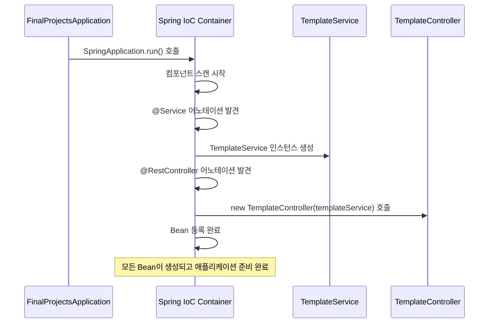

# Q001. Spring 생성자 호출 메커니즘

## 질문
`TemplateController`에서 `public TemplateController(TemplateService templateService)` 생성자는 누가 호출하는가?

## 답변

### 호출 주체: Spring IoC Container

`TemplateController`의 생성자는 **Spring Framework의 IoC Container가 자동으로 호출**합니다.

```java
@RestController
@RequestMapping("api/templates")
public class TemplateController {
    
    private final TemplateService templateService;
    
    // Spring IoC Container가 이 생성자를 호출
    public TemplateController(TemplateService templateService) {
        this.templateService = templateService;
    }
}
```

---

## 상세 설명

### 1. Spring Boot 애플리케이션 시작 과정

```java
@SpringBootApplication
public class FinalProjectsApplication {
    public static void main(String[] args) {
        // 이 시점에서 Spring이 모든 Bean을 생성하고 의존성을 주입
        SpringApplication.run(FinalProjectsApplication.class, args);
    }
}
```

Spring Boot가 시작되면서 다음 과정이 진행됩니다:

1. **애플리케이션 컨텍스트 초기화**
2. **컴포넌트 스캔 시작**
3. **Bean 생성 및 의존성 주입**
4. **웹 서버 시작**

### 2. Bean 생성 및 의존성 주입 과정



### 3. 의존성 주입 메커니즘 상세

#### 단계 1: 컴포넌트 스캔
```java
// Spring이 이 어노테이션들을 스캔
@Service  // TemplateService를 Bean으로 등록
@Transactional
public class TemplateService { ... }

@RestController  // TemplateController를 Bean으로 등록  
@RequestMapping("api/templates")
public class TemplateController { ... }
```

#### 단계 2: 의존성 분석
Spring이 `TemplateController`의 생성자를 분석:
- 파라미터: `TemplateService templateService`
- 필요한 의존성: `TemplateService` 타입의 Bean

#### 단계 3: 의존성 해결
```java
// Spring이 내부적으로 수행하는 과정 (의사 코드)
TemplateService templateServiceBean = applicationContext.getBean(TemplateService.class);
TemplateController templateController = new TemplateController(templateServiceBean);
applicationContext.registerBean("templateController", templateController);
```

#### 단계 4: Bean 등록 완료
생성된 `TemplateController` 인스턴스가 Spring Container에 등록되고, HTTP 요청이 오면 이 인스턴스를 사용합니다.

### 4. 생성자 기반 의존성 주입의 동작 흐름

```mermaid
flowchart TD
    A[Spring IoC Container 시작] --> B[컴포넌트 스캔 수행]
    B --> C[@RestController 어노테이션 발견]
    C --> D[TemplateController 클래스 분석]
    D --> E[생성자 의존성 확인]
    E --> F{TemplateService Bean 존재?}
    
    F -->|Yes| G[TemplateService Bean 주입]
    F -->|No| H[TemplateService Bean 생성 후 주입]
    
    G --> I[TemplateController 생성자 호출]
    H --> I
    I --> J[new TemplateController(templateService)]
    J --> K[Bean으로 등록]
    K --> L[의존성 주입 완료]
    
    style A fill:#e3f2fd
    style I fill:#fff3e0
    style L fill:#e8f5e8
```

---

## 핵심 개념

### 1. 제어의 역전 (Inversion of Control)
```java
// 전통적인 방식 (개발자가 직접 제어)
public class TemplateController {
    private TemplateService templateService = new TemplateService(); // 직접 생성
}

// Spring IoC 방식 (Spring이 제어)
@RestController
public class TemplateController {
    private final TemplateService templateService;
    
    public TemplateController(TemplateService templateService) {
        this.templateService = templateService; // Spring이 주입
    }
}
```

### 2. 생성자 주입 (Constructor Injection)
Spring에서 의존성을 주입하는 3가지 방법 중 **권장되는 방식**:

```java
// 1. 생성자 주입 (권장) - 현재 코드
public TemplateController(TemplateService templateService) {
    this.templateService = templateService;
}

// 2. 세터 주입 (선택적 의존성에 사용)
@Autowired
public void setTemplateService(TemplateService templateService) {
    this.templateService = templateService;
}

// 3. 필드 주입 (테스트하기 어려움, 비권장)
@Autowired
private TemplateService templateService;
```

### 3. 생성자 주입의 장점

| 장점 | 설명 | 예시 |
|------|------|------|
| **불변성** | `final` 키워드 사용 가능 | `private final TemplateService templateService;` |
| **필수 의존성 보장** | 객체 생성 시 모든 의존성 주입 | NPE 방지 |
| **테스트 용이성** | Mock 객체 쉽게 주입 | `new TemplateController(mockService)` |
| **순환 참조 방지** | 컴파일 타임에 감지 | 애플리케이션 시작 실패로 조기 발견 |

---

## 실제 동작 확인 방법

### 1. 로그를 통한 확인
`application.yml`에 다음 설정을 추가하면 Bean 생성 과정을 확인할 수 있습니다:

```yaml
logging:
  level:
    org.springframework.context: DEBUG
    org.springframework.beans: DEBUG
```

### 2. Bean 생성 순서 확인
```java
@RestController
public class TemplateController {
    
    public TemplateController(TemplateService templateService) {
        System.out.println("TemplateController 생성자 호출됨");
        this.templateService = templateService;
    }
}
```

### 3. 애플리케이션 컨텍스트에서 Bean 조회
```java
@Component
public class BeanChecker {
    
    @Autowired
    private ApplicationContext applicationContext;
    
    @PostConstruct
    public void checkBeans() {
        TemplateController controller = applicationContext.getBean(TemplateController.class);
        System.out.println("TemplateController Bean: " + controller);
    }
}
```

---

## 관련 어노테이션

### Controller 관련
- `@RestController` = `@Controller` + `@ResponseBody`
- `@RequestMapping`: URL 매핑 설정

### 의존성 주입 관련
- `@Autowired`: 자동 의존성 주입 (생성자가 1개일 때 생략 가능)
- `@Qualifier`: 같은 타입의 Bean이 여러 개일 때 구분
- `@Primary`: 우선적으로 주입할 Bean 지정

### Service 관련
- `@Service`: 비즈니스 로직 계층을 나타내는 컴포넌트
- `@Transactional`: 트랜잭션 관리

---

## 요약

| 구분 | 내용 |
|------|------|
| **누가** | Spring IoC Container |
| **언제** | 애플리케이션 시작 시 Bean 생성 과정에서 |
| **왜** | `@RestController` 어노테이션으로 Spring Bean 등록 대상이므로 |
| **어떻게** | 생성자 기반 의존성 주입 (Constructor-based DI) |
| **결과** | TemplateController 인스턴스가 Spring Container에 싱글톤으로 등록 |

이는 Spring Framework의 핵심 기능인 **IoC(제어의 역전)**과 **DI(의존성 주입)** 메커니즘에 의해 자동으로 처리되는 과정입니다.

---

## 참고자료
- [Spring Framework Documentation - Dependency Injection](https://docs.spring.io/spring-framework/docs/current/reference/html/core.html#beans-dependencies)
- [Spring Boot Reference Guide - Using Spring Boot](https://docs.spring.io/spring-boot/docs/current/reference/html/using.html)
- 프로젝트 문서: `01_프로젝트_개요_및_아키텍처.md`